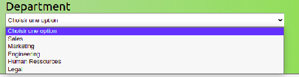

# 

# Select_menu

Select_menu is a package that allows you to integrate an HTML select. Select_menu use React. By installing this package you will avoid creating a select element and all the options. Currently, this package does not support creating a list without the `<optgroup>` category option. In the future, this will be possible.

## Settings

This package is programmed with **React**, you must work this language to be able to use it. It uses prop-types to secure transmitted data.

## Installation

To install this package on your computed , run this command :

`npm i @chris5477/scroll-menu`

If in the future , a new version coming , you can upgrade package with this command

`npm install @chris5477/scroll-menu@latest`

## Usage

Here is a simple example to use **_scroll-menu_**

    'import Select from "@chris5477/scroll-menu"

    const App = () => {
    return(
        

            <Select arr={[{text : "1", value :1}]}></Select>
        

        )}

    export default App'

## User guide

**_Scroll-menu_**

Allows to select an option among those available

**_Props_**

| Props Name   | Description                                                                              | Type   |
| ------------ | ---------------------------------------------------------------------------------------- | ------ |
| id           | Define an id to bind label and select                                                    | String |
| textLabel    | Display a text to name the label                                                         | String |
| selectClass  | A class CSS for select element                                                           | String |
| value        | Set value of select element                                                              | Any    |
| optionClass  | A class CSS for option element                                                           | String |
| arr          | A list object that contains a value and text property in order to fill in the options    | Array  |
| handleChange | A function retrieves the value of the selected option and fills the select value with it | Func   |

## Author

Chris5477

 [ Mon Github](https://github.com/Chris5477)

# Thank you
